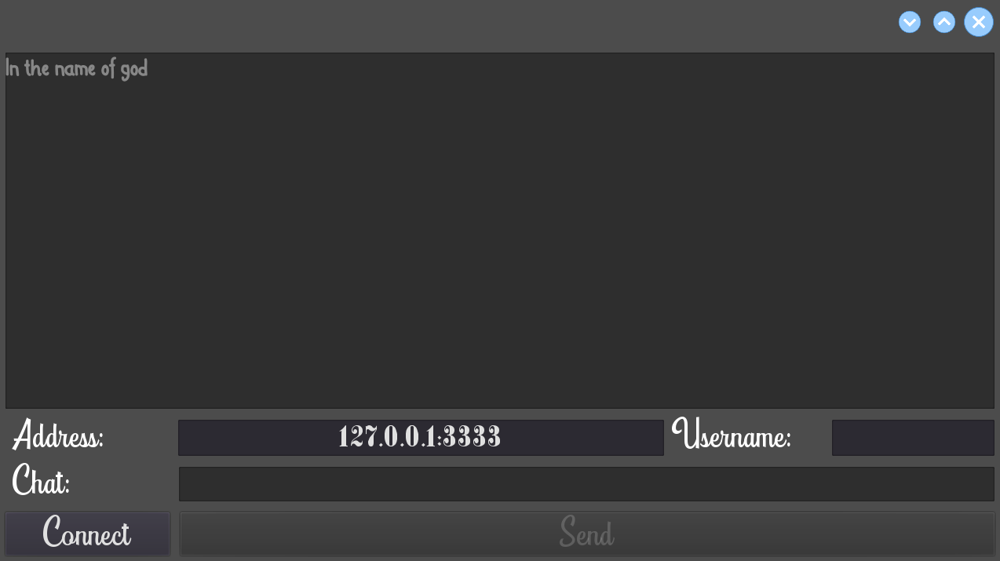

# Chat App

Created a chat app in godot that uses `nodejs` and `ws` as a framework to do the server side.\
It works fine.
References added down here in [Resources](#Resources) section.
Without no further to do, let's have at it.

## Client Side Preview

## Resources

1. Websockets Godot 3 Tutorial - Ready to use Client Example for your multiplayer game!:
   * https://www.youtube.com/watch?v=_tonScnpjGQ
2. Creating a headless lobby server with Godot and MultiplayerEnet:
   * https://www.youtube.com/watch?v=WXrGi6FmQeA
3. Websocket Server Tutorial Example Godot / NodeJS - Improve your game development!:
   * https://www.youtube.com/watch?v=rvjs15a1YjQ